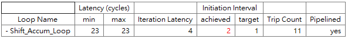
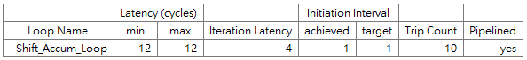

# pp4fpga_FIR

This repository is a self-learning project in the course **"Multimedia System-on-Chip Design (2020 Fall)."**

The project is to practice the **Finite Impulse Response filter in "Parallel Programming for FPGAs."**

## Table of Contents

* [About the Project](#about-the-project)
* [Usage](#usage)
* [Algorithm](#algorithm)
* [References](#references)
* [Contact](#contact)

## About the Project

This project is to practice the **Finite Impulse Response filter in "Parallel Programming for FPGAs."**

**Directory structure**

* **Figures/** - Figures in README.md
* **README.md** - Introduce the project
* **fir.h** - The header file
* **fir.c** - The C code of baseline solution
* **fir_hoist.c** - The C code of hoisted solution
* **fir_test.c** - The C testbench
* **run_hls_script.tcl** - The script for building all four HLS solutions.

## Usage

Run ***run_hls_script.tcl*** in Vivado HLS Command Prompt. It will generate two project with four solutions.

* **FIR**
  * baseline solution
  * baseline solution with pipelining
* **FIR_hoist**
  * hoisted solution
  * hoisted solution with pipelining

```
vivado_hls -f run_hls_script.tcl
```

## Algorithm

An 11-tap FIR filter is implemented, with one baseline solution and three optimizations.

* **Baseline**

  In the baseline solution, the `Shift_Accum_Loop` contains `if-else` condition.

  ```c
  Shift_Accum_Loop:
      for (int i = NUM_TAPS - 1; i >= 0; i--) {
          if (i == 0) {
              result += input * taps[0];
              delay_line[0] = input;
          } else {
              delay_line[i] = delay_line[i - 1];
              result += delay_line[i] * taps[i];
          }
      }
  ```

  The `if-else` condition inside of the for loop is inefficient. The calculation statements can only be executed after the conditional statement is resolved.

* **Baseline + Pipelining**

  Pipelining the baseline solution, the target II=1 cannot be achieved.

  

* **Hoisted**

  The statement under the `if` branch is executed only once. Therefore, this branch can be **'hoisted'** out of the loop.

  ```c
  Shift_Accum_Loop:
  	for (int i = NUM_TAPS - 1; i > 0; i--) {
  		delay_line[i] = delay_line[i - 1];
  		result += delay_line[i] * taps[i];
  	}
  	result += input * taps[0];
  	delay_line[0] = input;
  ```

* **Hoisted + Pipelining**

  Pipelining the hoisted solution, the target II=1 can be achieved now.

  

## References

* R. Kastner, J. Matai, S. Neuendorffer, *Parallel Programming for FPGAs*, arXiv:1805.03648, May, 2018.
* Lecture Notes of the course "Multimedia System-on-Chip Design (2020 Fall)."

## Contact

tofumanjeff@gmail.com